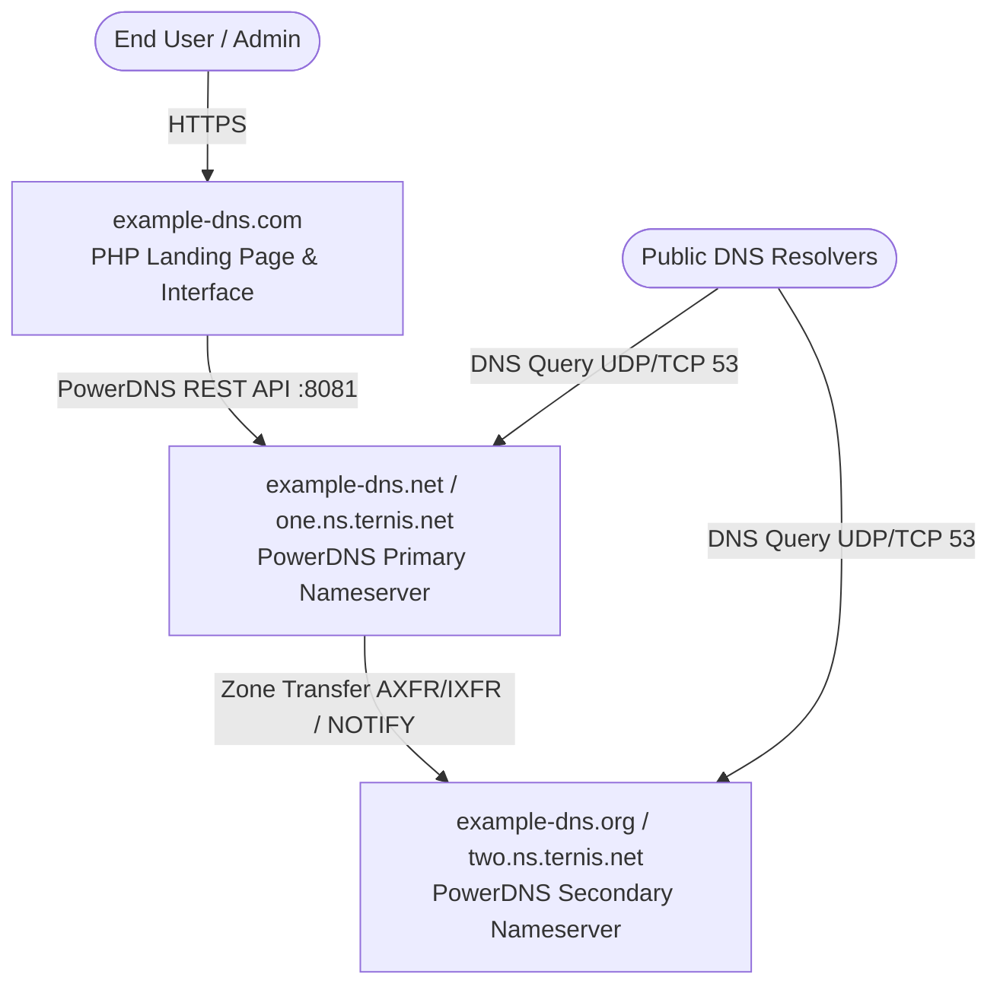

# System Architecture

`example-dns` is organized as a monorepo containing the applications, services, and infrastructure required to run the `example-dns` open-source DNS network.

## DNS Engine: PowerDNS

The authoritative nameserver infrastructure is powered by **PowerDNS Authoritative Server**:

- **Primary Nameserver (`example-dns.net`)**:
  - Operates in master mode (`primary=yes` / `master=yes`).
  - Exposes the PowerDNS HTTP REST API for automated zone creation, DNS record manipulation, and status reporting.
  - Backed by high-performance MariaDB (`gmysql`) or SQLite3 (`gsqlite3`) storage with DNSSEC enabled.
- **Secondary Nameserver (`example-dns.org`)**:
  - Operates in slave mode with automatic zone provisioning (`autosecondary=yes`).
  - Replicates zones from the primary nameserver via AXFR/IXFR and DNS NOTIFY messages.

## Domain Roles & Infrastructure

The ecosystem spans three designated domains, each serving a distinct architectural role:

| Domain | Role | Description | Monorepo Path |
| --- | --- | --- | --- |
| **`example-dns.com`** | Web Portal & Landing Page | The public landing page, administrative interface, and user dashboard. | [`apps/web`](../apps/web) |
| **`example-dns.net`** | Primary Nameserver | Authoritative primary PowerDNS node accepting record updates and zone mastering. | [`infra/powerdns/primary.conf`](../infra/powerdns/primary.conf) |
| **`example-dns.org`** | Secondary Nameserver | Authoritative secondary PowerDNS node providing redundancy and zone replication. | [`infra/powerdns/secondary.conf`](../infra/powerdns/secondary.conf) |

## High-Level Architecture

## Quad-Nameserver Topology (4-NS per zone)

In production, each domain hosted on the network can be delegated to all four nameservers:
- **`one.ns.ternis.net.`** (`77.90.60.110` / `2a14:7c0:1002:16c2::`)
- **`two.ns.ternis.net.`** (`94.249.188.145` / `2a14:7c0:1002:169c::`)
- **`example-dns.net.`** (`77.90.60.110` / `2a14:7c0:1002:16c2::`)
- **`example-dns.org.`** (`94.249.188.145` / `2a14:7c0:1002:169c::`)

This provides complete autonomous system and subnet diversification while supporting zero-downtime migration and brand interoperability.

For the live server addresses, database backends, and deployment details, see the **[Production Environment & Deployment Guide](production-deployment.md)**.
