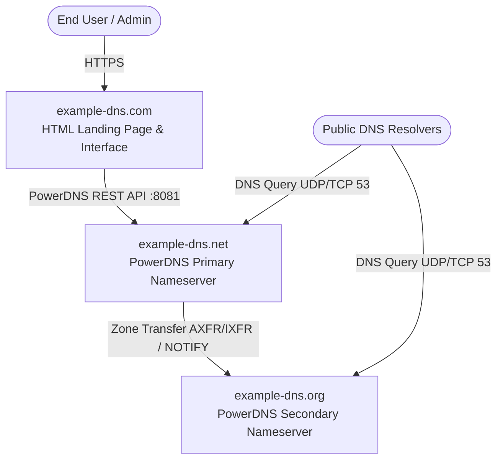

# System Architecture

`example-dns` is organized as a monorepo containing the applications, services, and infrastructure required to run the `example-dns` open-source DNS network.

## DNS Engine: PowerDNS

The authoritative nameserver infrastructure is powered by **PowerDNS Authoritative Server**:

- **Primary Nameserver (`example-dns.net`)**:
  - Operates in master mode.
  - Exposes the PowerDNS HTTP REST API for automated zone creation, DNS record manipulation, and status reporting.
  - Backed by high-performance SQLite/SQL storage with DNSSEC enabled.
- **Secondary Nameserver (`example-dns.org`)**:
  - Operates in slave mode with automatic zone provisioning (`autosecondary`).
  - Replicates zones from the primary nameserver via AXFR/IXFR and DNS NOTIFY messages.

## Domain Roles & Infrastructure

The ecosystem spans three designated domains, each serving a distinct architectural role:

| Domain | Role | Description | Monorepo Path |
| --- | --- | --- | --- |
| **`example-dns.com`** | Web Portal & Landing Page | The public landing page, administrative interface, and user dashboard. | [`apps/web`](../apps/web) |
| **`example-dns.net`** | Primary Nameserver | Authoritative primary PowerDNS node accepting record updates and zone mastering. | [`infra/powerdns/primary.conf`](../infra/powerdns/primary.conf) |
| **`example-dns.org`** | Secondary Nameserver | Authoritative secondary PowerDNS node providing redundancy and zone replication. | [`infra/powerdns/secondary.conf`](../infra/powerdns/secondary.conf) |

## High-Level Architecture



## Monorepo Layout

```
.
├── apps/
│   └── web/                     # example-dns.com HTML landing page & web app
├── infra/                       # PowerDNS configs, schema, Docker Compose, and deployment manifests
├── docs/                        # Architectural specifications and project documentation
├── LICENSE                      # MIT License
└── README.md                    # Project landing page and overview
```
