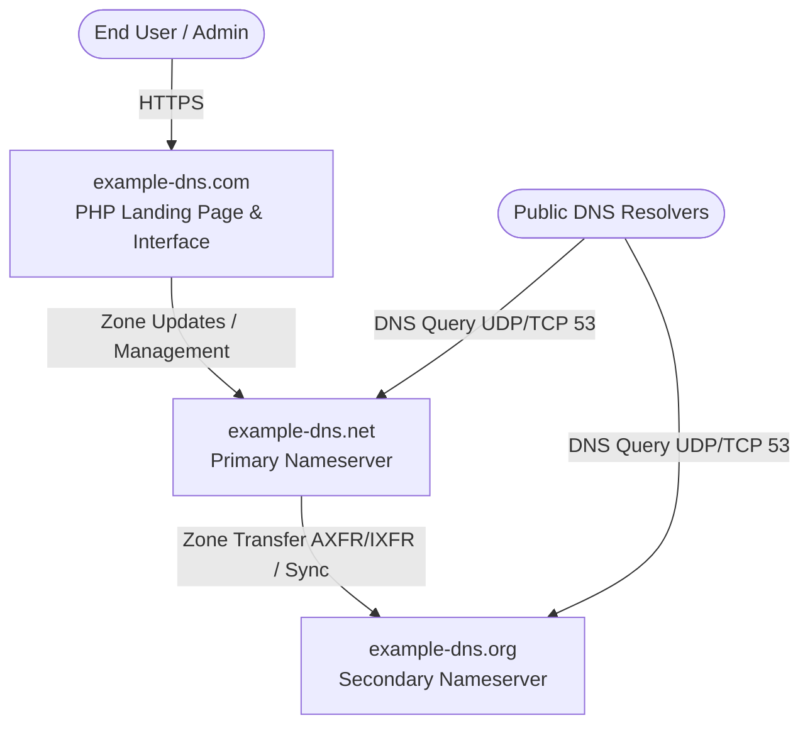

# System Architecture

`example-dns` is organized as a monorepo containing the applications, services, and infrastructure required to run the `example-dns` open-source DNS network.

## Domain Roles & Infrastructure

The ecosystem spans three designated domains, each serving a distinct architectural role:

| Domain | Role | Description | Monorepo Path |
| --- | --- | --- | --- |
| **`example-dns.com`** | Web Portal & Landing Page | The public landing page, administrative interface, and user dashboard. | [`apps/web`](../apps/web) |
| **`example-dns.net`** | Primary Nameserver | The primary authoritative DNS nameserver responsible for accepting record updates and zone mastering. | `infra/` / External node |
| **`example-dns.org`** | Secondary Nameserver | The secondary authoritative DNS nameserver providing redundancy, geographic distribution, and zone synchronization. | `infra/` / External node |

## High-Level Architecture



## Monorepo Layout

```
.
├── apps/
│   └── web/                     # example-dns.com PHP web application & landing page
├── infra/                       # Infrastructure-as-code, Docker, and deployment manifests
├── docs/                        # Architectural specifications and project documentation
├── LICENSE                      # MIT License
└── README.md                    # Project landing page and overview
```
