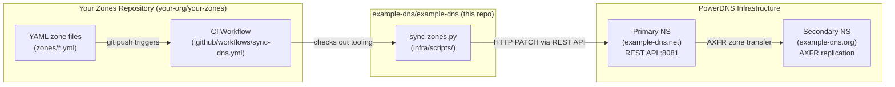
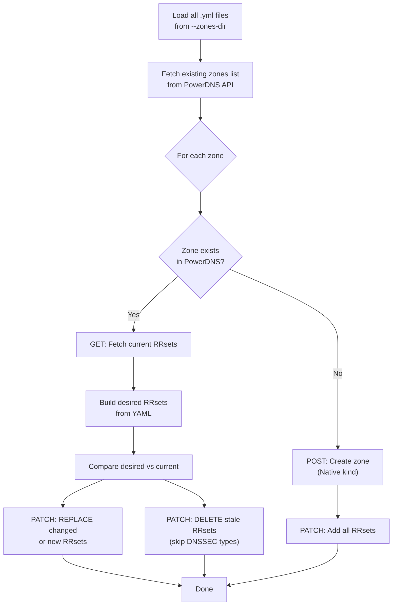

# DNS-as-Code with example-dns

> Manage your DNS records like software — version-controlled, peer-reviewed, and automatically deployed on every `git push`.

**Part of the [example-dns](https://github.com/example-dns/example-dns) project** — open-source authoritative DNS infrastructure powered by PowerDNS.

---

## Table of Contents

1. [What is DNS-as-Code?](#1-what-is-dns-as-code)
2. [Architecture](#2-architecture)
3. [YAML Zone File Format](#3-yaml-zone-file-format)
4. [Setup Guide](#4-setup-guide)
5. [GitHub Actions Setup](#5-github-actions-setup)
6. [Codeberg / Woodpecker CI Setup](#6-codeberg--woodpecker-ci-setup)
7. [Sync Script CLI Reference](#7-sync-script-cli-reference)
8. [How the Sync Works](#8-how-the-sync-works)
9. [Security Considerations](#9-security-considerations)
10. [Limitations & Known Caveats](#10-limitations--known-caveats)

---

## 1. What is DNS-as-Code?

DNS-as-Code is a workflow in which DNS zone configurations are stored in human-readable YAML files inside a Git repository. Instead of editing records through a web UI or CLI, you:

1. **Edit** a YAML file.
2. **Commit and push** the change.
3. **CI automatically syncs** the change to your PowerDNS server via the REST API.

This brings the full benefits of software engineering to DNS management:

| Benefit | Details |
|---|---|
| **Version history** | Every DNS change has an author, timestamp, and diff |
| **Peer review** | Open a pull/merge request before applying to production |
| **Disaster recovery** | Roll back any zone to a previous state with `git revert` |
| **Auditability** | Who changed what and when — tracked by Git |
| **Multi-environment** | Use branches or separate repos for staging vs. production |

---

## 2. Architecture



**Two-repo model:**

| Repository | Contents | Who owns it |
|---|---|---|
| `example-dns/example-dns` | Sync tooling, PowerDNS config, infra | example-dns project |
| `your-org/your-zones` | YAML zone files, CI workflow | You (fork/copy of `zones/` template) |

The sync script lives in the main repo and is checked out at CI time by your zones repo's workflow — meaning you always get the latest sync tooling without maintaining a copy.

---

## 3. YAML Zone File Format

Each domain gets its own `.yml` file named after the domain (e.g. `example-dns.com.yml`).

### Top-level fields

| Field | Type | Required | Description |
|---|---|---|---|
| `zone` | string | ✅ | The zone domain name (without trailing dot), e.g. `example-dns.com` |
| `ttl_default` | integer | ✅ | Default TTL in seconds. Applied to any record that omits `ttl`. |
| `records` | list | ✅ | Ordered list of record objects (see below) |

### Record fields

| Field | Type | Required | Description |
|---|---|---|---|
| `name` | string | ✅ | Record name. `@` = zone apex. Relative names like `www` are auto-expanded to `www.example.com.` |
| `type` | string | ✅ | DNS record type: `A`, `AAAA`, `CNAME`, `MX`, `NS`, `TXT`, `SOA`, `SRV`, `CAA`, `PTR`, … |
| `content` | string | ✅ | Record data in standard zone-file format. TXT records: wrap the value in double quotes within a YAML single-quoted string: `'"v=spf1 mx ~all"'` |
| `ttl` | integer | ❌ | Per-record TTL override. Falls back to `ttl_default` if omitted. |
| `priority` | integer | ❌ | Priority for `MX` and `SRV` records (also accepted as `prio`). Prepended to the content string automatically. |
| `disabled` | boolean | ❌ | When `true`, the record is sent to PowerDNS in a disabled state. Default: `false`. |

### Multi-value RRsets

Records with the same `name` and `type` are automatically merged into a single RRset. Just list them individually:

```yaml
# Both NS records → one RRset with two values
- name: "@"
  type: NS
  content: "ns1.example-dns.net."

- name: "@"
  type: NS
  content: "ns2.example-dns.org."
```

### Complete example zone file

```yaml
# zones/example-dns.com.yml
zone: example-dns.com
ttl_default: 3600

records:
  # SOA — zone authority record
  - name: "@"
    type: SOA
    content: "ns1.example-dns.net. hostmaster.example-dns.com. 2024010101 10800 3600 604800 3600"

  # Nameservers
  - name: "@"
    type: NS
    content: "ns1.example-dns.net."

  - name: "@"
    type: NS
    content: "ns2.example-dns.org."

  # Root A record with shorter TTL for flexibility
  - name: "@"
    type: A
    ttl: 300
    content: "203.0.113.1"

  # Web redirect
  - name: "www"
    type: CNAME
    content: "example-dns.com."

  # Mail exchange
  - name: "@"
    type: MX
    priority: 10
    content: "mail.example-dns.com."

  - name: "mail"
    type: A
    content: "203.0.113.2"

  # SPF
  - name: "@"
    type: TXT
    content: '"v=spf1 mx ~all"'

  # DMARC
  - name: "_dmarc"
    type: TXT
    content: '"v=DMARC1; p=reject; rua=mailto:dmarc@example-dns.com"'
```

---

## 4. Setup Guide

### Step 1 — Deploy PowerDNS with the REST API enabled

Follow the [infra/README.md](../infra/README.md) guide to deploy PowerDNS:

- **Docker**: `cd infra && docker compose up -d`
- **VPS**: `curl -sSL .../install-vps.sh | sudo bash -s -- --role primary`

Verify the API is reachable:

```bash
curl -s -H "X-API-Key: your-key" http://localhost:8081/api/v1/servers/localhost/zones
```

### Step 2 — Create your zones repository

Fork or copy the `zones/` directory from this repo into a new Git repository:

```
your-zones-repo/
├── zones/
│   ├── README.md
│   └── yourdomain.com.yml     ← rename and edit
└── .github/
    └── workflows/
        └── sync-dns.yml       ← copied from example-dns repo
```

### Step 3 — Write your zone files

Create one `.yml` file per domain under `zones/`. Use the example above or the template at [`zones/example-dns.com.yml`](../zones/example-dns.com.yml).

Key conventions:
- Name files `<domain>.yml` (e.g. `yourdomain.com.yml`)
- Always include a `SOA` record
- Include at least two `NS` records pointing at your nameservers
- Use `@` for the zone apex
- Increment the SOA serial on every change (format: `YYYYMMDDnn`)

### Step 4 — Test locally with dry-run

Before setting up CI, validate your zone files locally:

```bash
# Install deps
pip install requests PyYAML

# Dry run — no API calls, just shows planned changes
python infra/scripts/sync-zones.py \
  --zones-dir ./zones \
  --api-url http://localhost:8081 \
  --api-key your-api-key \
  --dry-run
```

### Step 5 — Set up CI

See sections 5 and 6 below for GitHub Actions and Codeberg CI setup.

---

## 5. GitHub Actions Setup

### Add secrets

In your zones repository → **Settings → Secrets and variables → Actions**, add:

| Secret name | Value |
|---|---|
| `PDNS_API_URL` | Full URL to your PowerDNS API, e.g. `http://ns1.yourdomain.com:8081` |
| `PDNS_API_KEY` | The value of `api-key` in your `pdns.conf` |

> [!CAUTION]
> Never commit your API key to the repository. Always use CI secrets/environment variables.

### Add the workflow file

Copy [`.github/workflows/sync-dns.yml`](../.github/workflows/sync-dns.yml) from this repo into your zones repository at the same path.

The workflow:
1. Checks out your zones repo
2. Checks out `example-dns/example-dns` to get the sync script (no copy needed)
3. Installs Python dependencies
4. Runs `sync-zones.py` with your secrets

### Pull Request dry-run (optional but recommended)

Add a second job to run the sync in `--dry-run` mode on PRs, so you can review planned changes before merging:

```yaml
on:
  pull_request:
    branches: [main, master]

jobs:
  dry-run:
    runs-on: ubuntu-latest
    steps:
      - uses: actions/checkout@v4
        with:
          path: zones-repo
      - uses: actions/checkout@v4
        with:
          repository: example-dns/example-dns
          path: example-dns-tools
      - run: pip install requests PyYAML
      - run: |
          python example-dns-tools/infra/scripts/sync-zones.py \
            --zones-dir zones-repo/zones \
            --api-url "${{ secrets.PDNS_API_URL }}" \
            --api-key "${{ secrets.PDNS_API_KEY }}" \
            --dry-run
```

---

## 6. Codeberg / Woodpecker CI Setup

### Add secrets

In your Codeberg repository → **Settings → Secrets**, add:

| Secret name | Value |
|---|---|
| `PDNS_API_URL` | Full URL to your PowerDNS API |
| `PDNS_API_KEY` | Your PowerDNS API key |

### Add `.woodpecker.yml`

Create `.woodpecker.yml` at the root of your zones repository:

```yaml
when:
  event: push
  branch:
    - main
    - master

steps:
  - name: checkout-zones
    image: alpine/git
    commands:
      - git clone --depth 1 "$CI_REPO_CLONE_URL" zones-repo

  - name: checkout-example-dns-tools
    image: alpine/git
    commands:
      - git clone --depth 1 https://codeberg.org/example-dns/example-dns.git example-dns-tools

  - name: sync-dns-zones
    image: python:3.11-alpine
    secrets:
      - PDNS_API_URL
      - PDNS_API_KEY
    commands:
      - pip install --quiet requests PyYAML
      - python example-dns-tools/infra/scripts/sync-zones.py
          --zones-dir zones-repo/zones
          --api-url "$PDNS_API_URL"
          --api-key "$PDNS_API_KEY"
```

> [!NOTE]
> Woodpecker CI's `$CI_REPO_CLONE_URL` automatically contains the authenticated clone URL for the current repository, so no extra token is needed for the zones checkout.

---

## 7. Sync Script CLI Reference

```
usage: sync-zones.py [-h] [--zones-dir DIR] [--api-url URL] [--api-key KEY]
                     [--zone ZONE] [--dry-run] [--timeout SECONDS]

DNS-as-Code sync tool for PowerDNS.
Reads YAML zone files and syncs them to the PowerDNS REST API.

Dependencies: pip install requests PyYAML
Full docs: https://github.com/example-dns/example-dns/blob/master/docs/dns-as-code.md

options:
  -h, --help           show this help message and exit
  --zones-dir DIR      Directory containing .yml zone files (default: ./zones)
  --api-url URL        PowerDNS API base URL (default: http://localhost:8081)
  --api-key KEY        PowerDNS API key.
                       Can also be set via the PDNS_API_KEY environment variable.
  --zone ZONE          Sync only this specific zone (e.g. example-dns.com)
  --dry-run            Show planned changes without making any API calls (read-only)
  --timeout SECONDS    HTTP request timeout in seconds (default: 30)
```

### Exit codes

| Code | Meaning |
|---|---|
| `0` | All zones synced successfully |
| `1` | One or more zones failed to sync (error details printed to stderr) |

### Environment variables

| Variable | Description |
|---|---|
| `PDNS_API_KEY` | Equivalent to `--api-key`. Useful in CI where secrets are injected as env vars. |

---

## 8. How the Sync Works

### High-level flow



### Name normalization

The script automatically expands relative record names to fully-qualified DNS names:

| YAML `name` | Zone | Normalized to |
|---|---|---|
| `@` | `example-dns.com` | `example-dns.com.` |
| `www` | `example-dns.com` | `www.example-dns.com.` |
| `mail.example-dns.com.` | `example-dns.com` | `mail.example-dns.com.` (unchanged) |

### RRset grouping

Records with the same `name` and `type` are merged into a single PowerDNS RRset. For example:

```yaml
- name: "@"
  type: NS
  content: "ns1.example-dns.net."
- name: "@"
  type: NS
  content: "ns2.example-dns.org."
```

Becomes one API RRset:
```json
{
  "name": "example-dns.com.",
  "type": "NS",
  "ttl": 3600,
  "changetype": "REPLACE",
  "records": [
    {"content": "ns1.example-dns.net.", "disabled": false},
    {"content": "ns2.example-dns.org.", "disabled": false}
  ]
}
```

### Priority handling (MX / SRV)

The `priority` field is prepended to the content string, as required by the PowerDNS API:

```yaml
- name: "@"
  type: MX
  priority: 10
  content: "mail.example-dns.com."
```

→ Sent as content `"10 mail.example-dns.com."` in the API call.

### DNSSEC protection

The following record types are **never deleted** by the sync script, even if absent from YAML:

`NSEC`, `NSEC3`, `RRSIG`, `DNSKEY`, `CDNSKEY`, `CDS`

These are managed automatically by PowerDNS when DNSSEC is enabled. Deleting them would break DNSSEC signing.

### Deletion of stale records

Any RRset present in PowerDNS but **absent from your YAML** (and not a DNSSEC type) is sent a `DELETE` changetype in the same PATCH request. This ensures your zone file is the single source of truth.

---

## 9. Security Considerations

### API key management

- **Never commit your API key.** Always use CI secrets or environment variables.
- Rotate the API key periodically and update CI secrets when you do.
- The API key in `pdns.conf` should be a long random string (e.g. `openssl rand -hex 32`).

### Network access

> [!CAUTION]
> The PowerDNS REST API (`webserver-port=8081`) must **never** be exposed to the public internet.

Recommended approaches to secure API access from CI:

| Method | Description |
|---|---|
| **VPN / WireGuard** | CI runner connects to a private network where the API is accessible |
| **SSH tunnel** | `ssh -L 8081:localhost:8081 user@ns1.yourdomain.com` then use `http://localhost:8081` |
| **Private network** | Cloud provider private subnet (e.g. AWS VPC, Hetzner private network) |
| **`webserver-allow-from`** | Restrict API to known CI IP ranges in `pdns.conf` |

Example `pdns.conf` restriction:

```ini
# Only allow API access from localhost and private subnets
webserver-allow-from=127.0.0.1,::1,10.0.0.0/8,172.16.0.0/12,192.168.0.0/16
```

### Least privilege

The API key used by CI only needs `PATCH` and `GET` access. If your PowerDNS version supports multiple API keys with different permissions, use a dedicated key for zone sync.

---

## 10. Limitations & Known Caveats

| Limitation | Details |
|---|---|
| **SOA serial management** | The sync script sends the SOA content exactly as written in YAML. You must manually increment the serial on every meaningful change. Consider using a date-based format (`YYYYMMDDnn`). |
| **Zone kind** | Zones are always created as `Native`. To use `Master`/`Slave` mode, pre-create the zone manually or extend the script. |
| **No DNSSEC signing** | The script does not trigger DNSSEC key generation or signing. Enable `dnssec=yes` in `pdns.conf` and use `pdnsutil` or the API to sign zones separately. |
| **Single server target** | The script syncs to one PowerDNS API endpoint. Secondary servers receive updates via AXFR automatically when using PowerDNS native replication. |
| **No multi-view** | PowerDNS views (split-horizon DNS) are not supported by this tooling. |
| **TXT record quoting** | TXT record content must include the surrounding double quotes as part of the content string. In YAML, use single-outer-quotes: `'"v=spf1 mx ~all"'`. |
| **Large zones** | The script does a full RRset replace on every push. For zones with thousands of records, consider batching or diffing to reduce API load. |
| **API connectivity from CI** | The PowerDNS API is not meant to be internet-facing. You must set up a VPN, SSH tunnel, or private network for CI to reach it. |
