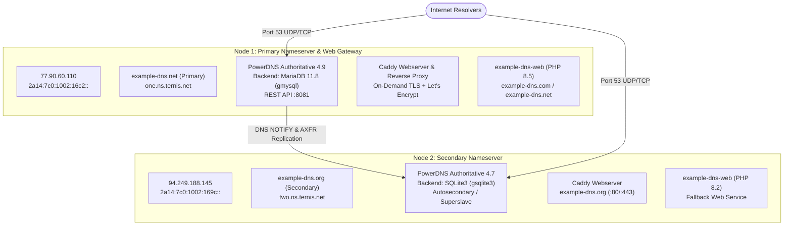

# Production Environment & Deployment Specification

This document details the live production deployment of the **`example-dns`** network, operated by [ternis.org](https://ternis.org) (by [ternis.dev](https://ternis.dev) and [ternis.net](https://ternis.net)).

---

## 1. Executive Summary & Open-Source Mission

`example-dns` is a **100% open-source** authoritative DNS infrastructure engineered for zero-downtime resilience, low-latency resolution, and registry compliance. It runs in a production dual-cluster topology that seamlessly interoperates with the `ternis.net` nameserver infrastructure.

- **License**: [MIT License](../LICENSE)
- **Author & Maintainer**: Fabian Ternis (`f.ternis@xpsystems.eu`)
- **Canonical Mirrors**:
  - GitHub: [https://github.com/example-dns/example-dns](https://github.com/example-dns/example-dns)
  - Codeberg: [https://codeberg.org/example-dns/example-dns](https://codeberg.org/example-dns/example-dns)

---

## 2. Production Topology & Cluster Nodes

The live cluster consists of two independent virtual server nodes hosted on diverse subnets and physical routing paths to fulfill strict registrar redundancy standards (such as DENIC for `.de` and AFNIC for `.fr`/`.re`).



### Node Specifications

| Parameter | Node 1 (Primary) | Node 2 (Secondary) |
| :--- | :--- | :--- |
| **Primary Domain** | `example-dns.net` | `example-dns.org` |
| **Legacy / Dual NS** | `one.ns.ternis.net` | `two.ns.ternis.net` |
| **Public IPv4** | `77.90.60.110` | `94.249.188.145` |
| **Public IPv6** | `2a14:7c0:1002:16c2::` | `2a14:7c0:1002:169c::` |
| **Operating System** | Debian 13 (Trixie) Linux x86_64 | Debian 12 (Bookworm) Linux x86_64 |
| **PowerDNS Daemon** | `pdns-server` v4.9 (`primary=yes`) | `pdns-server` v4.7 (`slave=yes`, `superslave=yes`) |
| **Database Backend** | MariaDB 11.8 (`powerdns` database via `gmysql`) | SQLite3 (`/var/lib/powerdns/pdns.sqlite3` via `gsqlite3`) |
| **REST API** | Port `8081` (protected with API key) | None (isolated replica) |
| **Web Server** | Caddy v2.10 with automated TLS | Caddy v2.6 with automated TLS |
| **Web Application** | PHP 8.5 (`example-dns-web.service` on port 8080) | PHP 8.2 (`example-dns-web.service` on port 8080) |

---

## 3. Quad-Nameserver (4-NS) Architecture

To support seamless transitions, white-label operations, and maximum redundancy, all domains hosted on the infrastructure can declare **all four nameservers**:

```text
NS  one.ns.ternis.net.
NS  two.ns.ternis.net.
NS  example-dns.net.
NS  example-dns.org.
```

### Benefits of the 4-NS Set:
1. **Multi-Subnet Diversity**: Spans subnet `77.90.60.0/24` (AS210083) and subnet `94.249.188.0/24` (AS207198).
2. **Zero Downtime Migration**: Existing domains using `ternis.net` can add `example-dns` nameservers with 0 downtime.
3. **Registry Compliance**: Passes automated registry validation tests (DENIC Nautic, AFNIC Zonemaster) with 0 errors.

---

## 4. Zone Templates in PowerDNS-Admin

The administration panel at **`https://ns-admin.ternis.net`** manages authoritative records with four standardized templates:

1. **`Default Standard Web`**:
   - NS: `one.ns.ternis.net`, `two.ns.ternis.net`, `example-dns.net`, `example-dns.org`
   - A: `77.90.60.110` (@, www)
   - AAAA: `2a14:7c0:1002:16c2::` (@, www)
2. **`Web + Mail (Standard)`**:
   - 4-NS set + Web A/AAAA records
   - MX: `10 mail.ternismail.de.`
   - SPF: `v=spf1 include:ternismail.de ~all`
   - DMARC: `v=DMARC1; p=quarantine; sp=quarantine; adkim=r; aspf=r`
3. **`Authoritative NS Only`**:
   - Clean slate with only the 4 authoritative NS records.
4. **`Dual-Cluster (All 4 Nameservers)`**:
   - Explicit quad-NS template for multi-tenant and open-source domain deployments.

---

## 5. Automated Supermaster Zone Replication

Whenever a zone is created or updated on Node 1:
1. Node 1 commits records to the MariaDB `powerdns` backend.
2. Node 1 sends DNS `NOTIFY` packets to Node 2 (`94.249.188.145`).
3. Node 2 checks its `supermasters` table in SQLite:
   ```sql
   SELECT nameserver, account FROM supermasters WHERE ip = '77.90.60.110';
   ```
   Accepted nameservers include `example-dns.net`, `ns1.example-dns.net`, and `one.ns.ternis.net`.
4. Node 2 automatically provisions the zone if not present and performs an AXFR zone transfer over TCP port 53.
5. Node 2 signs or serves DNSSEC records presigned by Node 1.

---

## 6. Web & SSL Deployment

- **`example-dns.com`**: Public landing page and documentation portal. Proxied via Caddy on Node 1 directly to `example-dns-web.service` on port 8080 with automated Let's Encrypt TLS certificates.
- **`example-dns.net`**: Primary nameserver apex with authoritative landing page.
- **`example-dns.org`**: Secondary nameserver apex served by Caddy on Node 2.
- **On-Demand TLS Validator**: Caddy queries the local Python ask endpoint (`127.0.0.1:9192/ask`), which verifies whether an incoming request domain is authoritatively hosted in PowerDNS before requesting an SSL certificate.

---

## 7. Verification & Health Monitoring

To verify the production cluster at any time:

```bash
# 1. Query Node 1 (Primary)
dig @77.90.60.110 example-dns.net SOA +short
dig @77.90.60.110 levoleurclo.de NS +short

# 2. Query Node 2 (Secondary)
dig @94.249.188.145 example-dns.org SOA +short
dig @94.249.188.145 levoleurclo.de NS +short

# 3. Check Web Service Response
curl -I https://example-dns.com
curl -I https://example-dns.net

# 4. Check PowerDNS daemon and zones
pdnsutil check-all-zones
```
